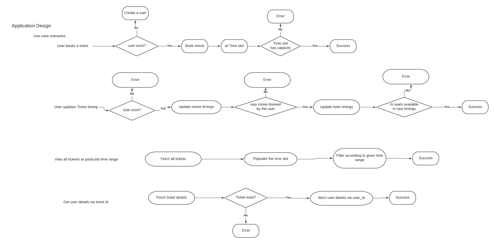
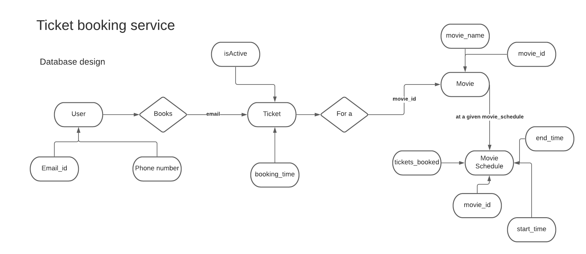

# Ticket Booking Service

## Task
To create a REST application for movie ticket bookings.
### User side Requirements
- As a user, I can book ticket for a movie at a given time slot if available.
- As a user, I can update booking timings if possible.
- As a user, I can fetch user details via ticket id.
- As a user, I can delete ticket if possible.
- As a user, I can retrieve all tickets at a given time.

### Application side requirements

- For a given slot for a movie upto 20 people can book tickets.
- Tickets should be set expired after 8 hours of booking time.

## Selected tech stack
 - Backend Service : NodeJS
 - Caching : Redis
 - Database: MongoDB

---
**To look over personal enchancements please checkout to personal branch :D.**

---
## Installation
- Make sure you have docker installed on your machine.
- Run `docker-compose up ` from root directory of application to start up redis server. (Please: Don't close this terminal instance).
- Open another terminal.
- To start server, write on your terminal `npm start` or `npm run dev`.
- This will run server on post `3000`.

## Testing
Test suites for basic functionality are added in repository layer as it contains most of the logic,to run test suites.

- Write `npm run test`.

**For manual testing, postman collection has been added in postman folder in root directory.**
 
**For Postman documentation, please visit <a href="https://documenter.getpostman.com/view/4450969/TVCcX9Fi" target="_blank">Here</a>.**

## Database design
### User
| Email | Phone Number  |  User_id |
|--|--|--|
| String| String; Max-Length:10  |Primary key |

### Movie

| Movie Name | Movie ID |
|--|--|
| String | Primary Key |

### Movie Schedule

| Time Slot Id | Movie ID | Start Time | End Time | Tickets booked |
|--|--|--|--|--|
| Primary key | Ref To Movie | Date or Number| Date or Number | Number |

### Ticket

| Ticket ID | User Id | Movie Schedule| 
|--|--|--|
| Primary key | Ref to User | Ref to Movie Schedule| 

### Code structure
The code follows design pattern known as <a href="https://medium.com/@pererikbergman/repository-design-pattern-e28c0f3e4a30" target="_blank">Repository design pattern </a>.
Each entity has been divided into module and each module has three layers of abstraction from controllers to repository, making them reusable.

## Initial Brainstorming 

Idea was to build to scalable and module backend infrastructure which follows SOLID design patterns, also making sure database should be as normalised as possible.

### Application architecture

Each entity is considered as a module and build in a such way that it can wire up with other modules easily.

### Requirements Flow

### Database Design

